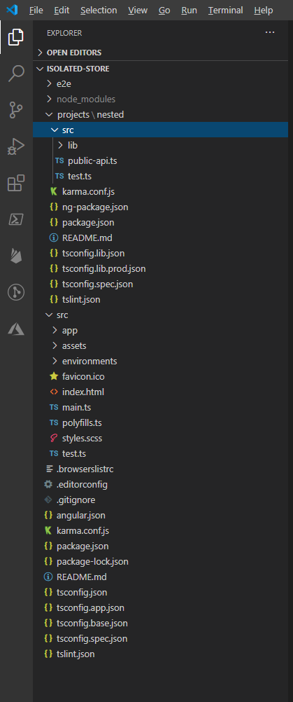
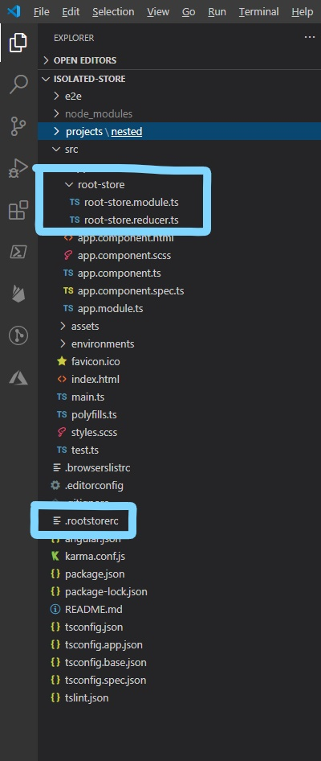
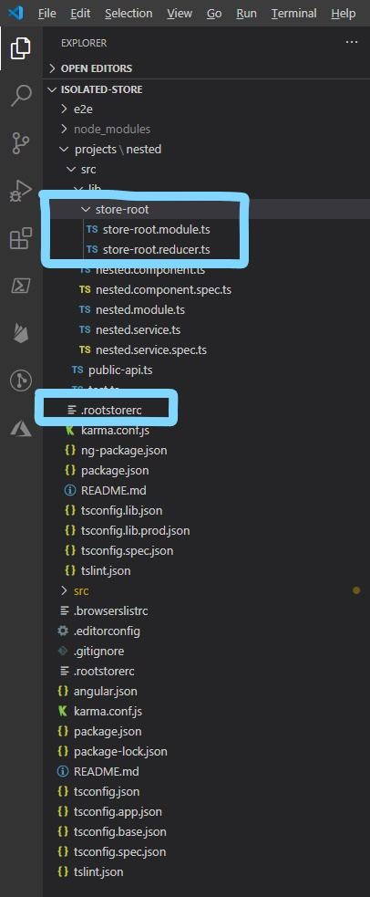
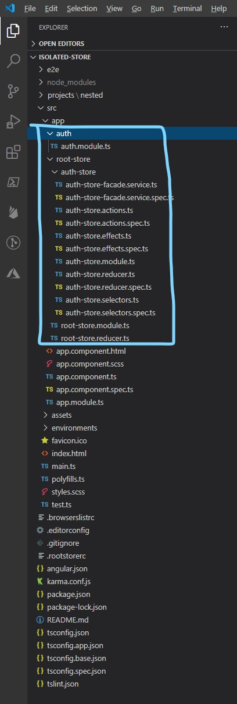

## NgRx - Isolated Store Pattern
I have been working with Angular for a long time and adopted NgRx pretty early too. I didn't have a problem with all the boiler plate as many did, I like explicit so NgRx being so explicit suited my style. However it was never clear what was considered best practice. While learning NgRx I came across several different styles and for a while adopted the one I felt least uncomfortable with and the most strongly typed. Periodically I would google NgRx Best Practices and eventually came across two blog posts. [NgRx - Best Practices for Enterprise Applications](https://itnext.io/ngrx-best-practices-for-enterprise-angular-applications-6f00bcdf36d7) by Wes Grimes and [The sandbox pattern](https://blog.strongbrew.io/A-scalable-angular-architecture-part2/) by Brecht Billiet. Individually they didn't quite do it for me, but in my head a pattern combining elements from them both formed very quickly and I applied it to a personal project I was just getting started on.  The first name that came to mind for the patter was Isolated Store, which seemed appropriate and not wanting to waste too much time on a name I decided to go with it (I am open to suggestions for a more appropriate name).

Initialy I thought of creating a public seed project that was generated with the Angular CLI and the Isolated Store pattern implemented. Whilst a seed projet gets you started on a new Isolated Store project, it doesn't really help when you want to apply the pattern to an existing project.  Also in any project there is still quite a bit of manual work to do to apply the pattern to new feature modules, so I decided to create and publish an *npm* package with Angular Schematics that make it easy to implement the Isolated Store pattern in any Angular project.

### Pattern Basics
The basic principles of the Isolated Store pattern:

+ Angular elements should not be aware they are using an NgRx store
+ Stores should be isolated from Angular feature modules

## Implementing Isolated Store with Schematics
In this section I will run through how you use the Angular CLI to create a new project and use the schematics in this package to apply the Isolated Store pattern to it.  As they say *a picture speaks a thousand words* so I will include screen shots for each step.  I am assuming you have Node and npm installed

Lets start by making sure we have the latest Angular CLI installed

```bash
npm install -g @angular/cli
```

Next we create a new Angular project.  I keep all my Git repos below a root folder at C:\\_git.  With a terminal focused on your own equivalent create a new project and open it in your preferred editor.  I will use VS Code and accept defaults when prompted by the CLI.

```bash
ng new isolated-store
cd isolated-store
code .
```

I want to demonstrate how the schematics can work with nested projects so I am going to add a project to the new app.  Back in my terminal I execute
```bash
ng g library nested
```

In VS Code the workspace structure looks like this



Next we install this schematics package (Plans are afoot to support ng add)
```bash
npm install @ngxtend/isolated-store
```

### Root Store
The Isolated Store pattern as the name suggests isolates all of the NgRx stores from other application or library project code.  To achieve this we create a Root Store within a project then add Feature Stores to it.  Typically you will create a Feature Store for each Feature Module.

To prepare a project for the Isolated Store pattern and generate a Root Store we execute the root-store schematic in a terminal, usually at the root of the workspace
```bash
    ng g @ngxtend/isolated-store:root-store
```
This uses the defaults and adds a module named *root-store* to the default project, usually *app*.  It also detects whether you have the appropriate NgRx dependencies installed in the project and if not installs them via npm.

After running the above the VS Code workspace structure looks like this




#### root-store.module.ts
The Root Store is little more than an Angular module that acts as a single point of entry for application state.  It initialises NgRx with root StoreModule and EffectsModule imports.  The module definition looks like this
```typescript
import { NgModule } from '@angular/core';
import { CommonModule } from '@angular/common';
import { StoreModule } from '@ngrx/store';
import { EffectsModule } from '@ngrx/effects';

import { rootStoreReducer, metaReducers } from './root-store.reducer';

@NgModule({
  declarations: [],
  imports: [
    CommonModule,
    StoreModule.forRoot(rootStoreReducer, {
      metaReducers,
      runtimeChecks: {
        strictStateImmutability: true,
        strictActionImmutability: true
      }
    }),
    EffectsModule.forRoot([])
  ]
})
export class RootStoreModule {}

```

#### root-store.reducer.ts
A root reducer is created that takes care of iniitialising a meta-reducer collection based on the current environment.  The root reducer definition looks like this
```typescript
import { ActionReducerMap, MetaReducer } from '@ngrx/store';
import { environment } from '../../environments/environment';

export interface RootStoreState {}

export const rootStoreReducer: ActionReducerMap<RootStoreState> = {};

export const metaReducers: MetaReducer<RootStoreState>[] = !environment.production ? [] : [];

```

#### .rootstorerc
A Root Store configuration file is added to the project, which is used when adding Feature Stores.  A default configuration file looks like this
```json
{
  "rootStoreModuleName": "root-store",
  "rootStoreModuleFilePath": "src/app/root-store/root-store.module.ts",
  "rootStoreModuleFolderPath": "src/app/root-store/"
}
```

#### Options
The *root-store* schematic supports two options

Option|Description|Default|Example
------|-----------|-------|-------
name|Specifies a name for the root store module|root-store|ng g @ngxtend/isolated-store:root-store --name store-root
project|Specifies the project to add a root store module to|Default project from angular.json, usually app|ng g @ngxtend/isolated-store:root-store --project nested

To demonstrate the options we will use both of them to add a Root Store to our *nested* project with a non-default name
```bash
ng g @ngxtend/isolated-store:root-store --name store-root --project nested
```

After running the above, the VS Code nested project structure looks like this



In both cases the project module (app.module.ts, nested.module.ts) are updated to import the Root Store module, making all store related functionality available throughout the project without any futher imports when adding Feature Stores.

### Feature Stores
Once the Root Store is configured for a project you can add Feature Stores using the *@ngxtend/isolated-store:feature-store* schematic.  This schematic adds an Angular module nested below the Root Store and initialises it with NgRx reducer, actions, effects and selectors to get you started.  It also adds a Facade Service for the feature store.  This Facade Service is how application or project components interact with the NgRx store, this way modules are isolated from any knowledge of NgRx or how state is managed.  The Facade Service encapsulates all interaction with NgRx meaning to interact with any slice of the application state you need only inject the appropriate service.

For example to add an *auth* module with a corresponding feature store we would execute the following
```bash
ng g module auth
ng g @ngxtend/isolated-store:feature-store auth
```

After running both of the above commands the VS Code project structure looks like this



Ignoring the spec files for now we will take a look at the content of store module files

#### auth-store.module.ts
This is the Angular module and it prepares the module as a Feature Store setting the store and effects modules for the feature

```typescript
import { NgModule } from '@angular/core';
import { CommonModule } from '@angular/common';
import { StoreModule } from '@ngrx/store';
import { EffectsModule } from '@ngrx/effects';

import { authStoreReducer } from './auth-store.reducer';
import { AuthStoreEffects } from './auth-store.effects';

@NgModule({
  imports: [
    CommonModule,
    StoreModule.forFeature('auth', authStoreReducer),
    EffectsModule.forFeature([AuthStoreEffects])
  ]
})
export class AuthStoreModule {}

```

#### auth-store.recucer.ts
This defines the slice of state for the module and initialises a *reducer* for the feature store and is imported into the module shown above.  Notice we have an  *isInitialised* property on our state.  This is used throughout the module to provide simple examples of how the files are used.
```typescript
import { AuthStoreActions, AuthStoreActionTypes } from './auth-store.actions';

export interface AuthState {
    isInitialised: boolean;
}

export const initialAuthState: AuthState = {
    isInitialised: false
};

const reducter = createReducer(initialAuthState,
  On(initialiseModuleSucceeded, (state: AuthState) => ({
                ...state,
                isInitialised: true
            }))
    );

export const authStoreReducer = (state: AuthState | undefined, action: Action): AuthState = reducer(state, action);
```

#### auth-store.efects.ts
This provides a base Effects service for the feature store, with an example of a simple effect that deals with dispatching an action when an action with side effects is triggered. This is imported into the feature store module and used to initialise an effects module.
```typescript
import { Injectable } from '@angular/core';
import { Actions, createEffect, ofType } from '@ngrx/effects';
import { Store } from '@ngrx/store';
import { catchError, exhaustMap } from 'rxjs/operators';
import { EMPTY, of } from 'rxjs';

import { AuthState } from './auth-store.reducer';
import { initialiseModule, initialiseModuleSucceeded } from './auth-store.actions';

@Injectable()
export class AuthStoreEffects {
  
  initialiseModule$ = createEffect(() => this.actions$.pipe(
    ofType(nitialiseModule),
    exhaustMap(a => of(initialiseModuleSucceeded())),
    catchError(e => {
      console.log(e);
      return EMPTY;
    })
  );

  constructor(
    private actions$: Actions,
    private store: Store<AuthState>
  ) { }
}
```

#### auth-store.actions.ts
This defines the actions supported by the feature store and its elements are imported into the reducer and effects files shown above
```typescript
import { createAction } from '@ngrx/store';

export enum AuthStoreActionTypes {
    InitialiseModule = '[Auth] Initialise module',
    InitialiseModuleSucceeded = '[Auth] Initialise module succeeded'
}

export const initialiseModule = createAction(AuthStoreActionTypes.InitialiseModule);

export const initialiseModuleSucceeded = createAction(AuthStoreActionTypes.InitialiseModuleSucceeded);
```

#### auth-store.selectors.ts
This defines selectors for accessing parts of the feature state. I prefer my selectors in a separate file so this schematic implements that preference.  I know some prefer selectors to be merged with actions or reducer, but with future schematics in mind for creating actions, selectors and effects I chose to go with separate files.
```typescript
import { createFeatureSelector, createSelector } from '@ngrx/store';

import { AuthState } from './auth-store.reducer';

export const getAuthFeature = createFeatureSelector<AuthState>('auth');

export const getIsInitialised = createSelector(
  getAuthFeature,
  (state: AuthState) => state.isInitialised
);
```

#### auth-store-facade.service.ts
This defines the service that the feature module and any other service of component will inject and use to access the feature store.  Typically as you implement application features you wil extend this service, which will lead you to define the state, actions, effects and selectors you need.
```typescript
import { Injectable } from '@angular/core';
import { Observable } from 'rxjs';
import { Store, select } from '@ngrx/store';

import { AuthState } from './auth-store.reducer';
import { getIsInitialised } from './auth-store.selectors';

export interface IAuthStoreFacade {
  isInitialised$: Observable<boolean>;
}

@Injectable({
  providedIn: 'root'
})
export class AuthStoreFacade implements IAuthStoreFacade {
  constructor(private store: Store<AuthState>) {}

  public get isInitialised$(): Observable<boolean> {
    return this.store.pipe(select(getIsInitialised));
  }
}

```

#### Options
The *feature-store* schematic supports several options
Option|Description|Default|Example
------|-----------|-------|-------
feature|The name of the feature the feature store applies to|none, this is required|ng g @ngxtend/isolated-store:feature-store auth
project|Specifies the project to add a feature store module to|Default project from angular.json, usually app|ng g @ngxtend/isolated-store:feature-store auth --project nested
nospec|If present, disables generation of spec files for the feature store|false|ng g @ngxtend/isolated-store:feature-store auth --nospec
storename|Allows you to override the default name for the store|*feature*Store, which is dasherised or classified to generate file and folder names.  This should be a camel cased name.|ng g @ngxtend/isolated-store:feature-store auth --storename myAuthStore


### Real Examples
The following snippets show how I have taken the starting point shown above and extended it to provide create an auth-buttons component for an application.  The application uses @angular/material and @angular/fire with firebase authentication.

#### auth-buttons.component.html
```html
<a mat-button (click)='signIn()' *ngIf='(isAuthenticated$ | async) == false'>
  <mat-icon color='accent' class='icon-lg'>account_circle</mat-icon>
</a>
<span>{{userDisplayName$ | async}}</span>
<a mat-button (click)='signOut()' *ngIf='isAuthenticated$ | async'>
  <mat-icon color='accent' class="icon-lg" *ngIf='(userPicture$ | async) == undefined'>account_circle</mat-icon>
  
</a>
```

#### auth-buttons.component.ts
```typescript
import { Component } from '@angular/core';
import { Observable } from 'rxjs';
import { AuthStoreFacade } from 'src/app/root-store/auth-store/auth-store-facade.service';

@Component({
  selector: 'app-auth-buttons',
  templateUrl: './auth-buttons.component.html',
  styleUrls: ['./auth-buttons.component.scss']
})
export class AuthButtonsComponent {
  public isAuthenticated$: Observable<boolean>;
  public userDisplayName$: Observable<string | undefined | null>;
  public userPicture$: Observable<string | undefined | null>;

  constructor(private authStoreFacade: AuthStoreFacade) {
    this.isAuthenticated$ = this.authStoreFacade.isAuthenticated();
    this.userDisplayName$ = this.authStoreFacade.userDisplayName();
    this.userPicture$ = this.authStoreFacade.userPicture();
  }

  public signIn(): void {
    this.authStoreFacade.signIn();
  }

  public signOut(): void {
    this.authStoreFacade.signOut();
  }
}
```

#### auth-store-facade.service.ts
```typescript
import { Injectable } from '@angular/core';
import { Observable, Subject } from 'rxjs';
import { Store, select } from '@ngrx/store';

import { NotificationService } from '../../shared/notification.service';

import { AuthState } from './auth-store.reducer';
import {
  signInAction,
  signOutAction,
  silentSignInAction,
} from './auth-store.actions';
import {
  getIsAuthenticated,
  getDisplayName,
  getPicture,
  getUserId,
} from './auth-store.selectors';
@Injectable({
  providedIn: 'root',
})
export class AuthStoreFacade {
  private readonly isAuthenticated$: Observable<boolean>;
  private readonly signInFailedSubject: Subject<string> = new Subject<string>();
  private readonly signInSucceededSubject: Subject<void> = new Subject<void>();
  private readonly signOutSucceededSubject: Subject<void> = new Subject<void>();
  private readonly silentSignInCompletedSubject: Subject<boolean> = new Subject<boolean>();
  private readonly userFullName$: Observable<string>;
  private readonly userPicture$: Observable<string>;
  private readonly userId$: Observable<string>;

  constructor(private store: Store<AuthState>, private notificationService: NotificationService) {
    this.isAuthenticated$ = this.store.pipe(select(getIsAuthenticated));
    this.userFullName$ = this.store.pipe(select(getDisplayName));
    this.userPicture$ = this.store.pipe(select(getPicture));
    this.userId$ = this.store.pipe(select(getUserId));
  }

  public isAuthenticated(): Observable<boolean> {
    return this.isAuthenticated$;
  }

  public signInFailed(): Observable<string> {
    return this.signInFailedSubject.asObservable();
  }

  public signInSucceeded(): Observable<void> {
    return this.signInSucceededSubject.asObservable();
  }

  public signOutSucceeded(): Observable<void> {
    return this.signOutSucceededSubject.asObservable();
  }

  public silentSignInCompleted(): Observable<boolean> {
    return this.silentSignInCompletedSubject.asObservable();
  }

  public notifySignInFailed(error: string): void {
    this.signInFailedSubject.next(error);
  }

  public notifySignInSucceeded(): void {
    this.signInSucceededSubject.next();
  }

  public notifySignOutSucceeded(): void {
    this.signOutSucceededSubject.next();
  }

  public notifySilentSignInCompleted(succeeded: boolean): void {
    this.silentSignInCompletedSubject.next(succeeded);
  }

  public signIn(): void {
    this.store.dispatch(signInAction());
  }

  public signOut(): void {
    this.store.dispatch(signOutAction());
  }

  public trySilentSignIn(): void {
    this.store.dispatch(silentSignInAction());
  }

  public userDisplayName(): Observable<string> {
    return this.userFullName$;
  }

  public userId(): Observable<string> {
    return this.userId$;
  }

  public userPicture(): Observable<string> {
    return this.userPicture$;
  }
}

```

#### auth-store.action.ts
```typescript
import { createAction, props } from '@ngrx/store';
import { auth } from 'firebase/app';

export enum AuthStoreActionTypes {
  SignIn = '[Auth] - Sign In',
  SignInSucceeded = '[Auth] - Sign In Succeeded',
  SignInFailed = '[Auth] - Sign In Failed',
  SignOut = '[Auth] - Sign Out',
  SignOutCompleted = '[Auth] - Sign Out Completed',
  SilentSignIn = '[Auth] - Silent Sign In',
  SilentSignInSucceeded = '[Auth] - Silent Sign Sign In Succeeded',
  SilentSignInFailed = '[Auth] - Silent Sign Sign In Failed'
}

export const signInAction = createAction(AuthStoreActionTypes.SignIn);

export const signInSucceededAction = createAction(AuthStoreActionTypes.SignInSucceeded, props<{ payload: auth.UserCredential }>);

export const signInFailedAction = createAction(AuthStoreActionTypes.SignInFailed, props<{ payload: string }>);

export const signOutAction = createAction(AuthStoreActionTypes.SignOut);

export const signOutCompletedAction = createAction(AuthStoreActionTypes.SignOutCompleted);

export const silentSignInAction = createAction(AuthStoreActionTypes.SilentSignIn);

export const silentSignInSucceededAction = createAction(AuthStoreActionTypes.SilentSignInSucceeded, props<{ payload: firebase.User }>);

export const silentSignInFailedAction = createAction(AuthStoreActionTypes.SilentSignInFailed);

```

#### auth-store.effects.ts
```typescript
import { Injectable } from '@angular/core';
import { Actions, createEffect, ofType } from '@ngrx/effects';
import { Observable, of, from, EMPTY } from 'rxjs';
import { catchError, map, tap, switchMap } from 'rxjs/operators';
import { AngularFireAuth } from '@angular/fire/auth';
import { auth } from 'firebase/app';

import { AuthStoreFacade } from './auth-store-facade.service';
import {
  signInAction,
  signInSucceededAction,
  signInFailedAction,
  signOutAction,
  signOutCompletedAction,
  silentSignInAction,
  silentSignInSucceededAction,
  silentSignInFailedAction
} from './auth-store.actions';

@Injectable()
export class AuthStoreEffects {
  
  signIn$ = createEffect(() => this.actions$.pipe(
    ofType(signInAction),
    switchMap(() => {
      return from(this.afAuth.signInWithPopup(new auth.GoogleAuthProvider()));
    }),
    map(credential => signInSucceededAction({payload: credential })),
    catchError(e => {
      console.error(e.message);
      return of(signInFailedAction({ payload: e.message }));
    })
  ));

  signInSucceeded$ = createEffect(() => this.actions$.pipe(
    ofType(signInSucceededAction),
    tap(() => this.authStoreFacade.notifySignInSucceeded())
  ), { dispatch: false });

  signInFailure$ = createEffect(() => this.actions$.pipe(
    ofType(signInFailedAction),
    tap((a: signInFailedAction) => this.authStoreFacade.notifySignInFailed(a.payload))
  ), { dispatch: false });

  signOut$ = createEffect(() => this.actions$.pipe(
    ofType(signOutAction),
    switchMap(() => {
      return from(this.afAuth.signOut());
    }),
    map(() => signOutCompletedAction()),
    catchError(e => {
      console.error(e.message);
      return EMPTY;
    })
  ));

  signOutComplete$ = createEffect(() => this.actions$.pipe(
    ofType(signOutCompletedAction),
    tap(() => {
      this.authStoreFacade.notifySignOutSucceeded();
    })
  ), { dispatch: false });

  silentSignIn$ = createEffect(() => this.actions$.pipe(
    ofType(silentSignInAction),
    switchMap(() => {
      return this.afAuth.authState;
    }),
    map(user => {
      if (user) {
        this.authStoreFacade.notifySilentSignInCompleted(true);
        return silentSignInSucceededAction({ payload: user });
      } else {
        this.authStoreFacade.notifySilentSignInCompleted(false);
        return silentSignInFailedAction();
      }
    }),
    catchError(e => {
      console.error(e.message);
      return EMPTY;
    })
  );

  constructor(
    private actions$: Actions,
    private authStoreFacade: AuthStoreFacade,
    private afAuth: AngularFireAuth
  ) {}
}

```

#### auth-store.reducer.ts
```typescript
import { createReducer, on } from '@ngrx/store';
import { auth } from 'firebase/app';

import {
  signInSucceededAction,
  silentSignInSucceededAction
} from './auth-store.actions';

export interface AuthState {
  isAuthenticated: boolean;
  userId: string;
  email: string;
  displayName: string;
  pictureUrl: string;
}

export const initialAuthStoreState: AuthState = {
  isAuthenticated: false,
  userId: '',
  email: '',
  displayName: '',
  pictureUrl: ''
};

const reducer = createReducer(initialAuthStoreState,
  on(signInSuccessAction, (state: AuthState, { payload }) => mapUserToState(payload)),
  on(signInFailedAction, (state: AuthState) => Object.assign({}. initialAuthStoreState)),
  on(signOutCompletedAction, (state: AuthState) => Object.assign({}. initialAuthStoreState)),
  on(silentSignInFailedAction, (state: AuthState) => Object.assign({}. initialAuthStoreState)),
  on(silentSignInSucceededAction, (state: AuthState, { payload }) => mapUserToState(payload)),
);

export const authStoreReducer = (state: AuthState | undefined, action: Action): AuthState => reducer(state, action);
  
function mapUserToState(user: firebase.User | null): AuthState {
  return {
    ...state,
    isAuthenticated: true,
    userId: user?.uid ?? '',
    email: user?.email ?? '',
    displayName: user?.displayName ?? '',
    pictureUrl: user?.photoURL ?? ''
  };
}

```

#### auth-store.selectors.ts
```typescript
import { createFeatureSelector, createSelector } from '@ngrx/store';
import { AuthState } from './auth-store.reducer';

export const getAuthFeature = createFeatureSelector<AuthState>('auth');

export const getIsAuthenticated = createSelector(
  getAuthFeature,
  (s: AuthState) => s.isAuthenticated
);

export const getDisplayName = createSelector(
  getAuthFeature,
  (s: AuthState) => s.displayName
);

export const getPicture = createSelector(
  getAuthFeature,
  (s: AuthState) => s.pictureUrl
);

export const getUserId = createSelector(
  getAuthFeature,
  (s: AuthState) => s.userId
);

```

